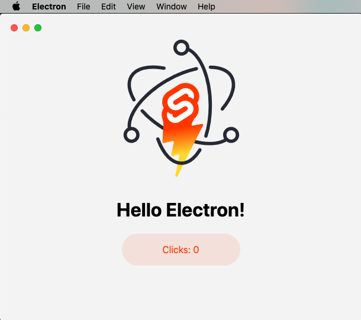

  

# Sveltekit + Electron

Minimal [Sveltekit](https://github.com/sveltejs/kit#readme) + [Electron](https://www.electronjs.org/) starter template.

 

## Getting Started
> *Feel free to substitute `npm` with `pnpm` or `yarn`.

|         |                                             |
| ------- | ------------------------------------------- |
| Clone   | · `npx degit fractalhq/sveltekit-electron ` |
| Install | · `npm install`                             |
| Develop | · `npm run dev`                             |
| Build   | · `npm run build`                           |

 

  

## Recommended IDE Setup

[VSCode](https://code.visualstudio.com/) + [Svelte for VSCode](https://marketplace.visualstudio.com/items?itemName=svelte.svelte-vscode)

## Change Build Targets

In the scripts section of package.json you can update the `build:electron` command and change the flags to set the targets, by default it uses  `-mwl` which is Mac, Windows, and Linux